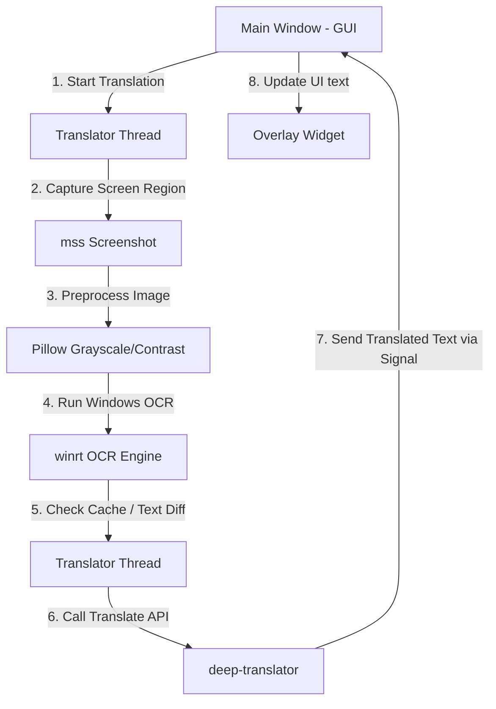

# Kỹ năng win-translate (win-translate Skill)

Kỹ năng này cung cấp các hướng dẫn chi tiết dành cho AI Agent để vận hành, kiểm thử và phát triển dự án **win-translate**.

## Cách khởi chạy ứng dụng

1. **Cài đặt môi trường**:
   Đảm bảo các thư viện trong `requirements.txt` đã được cài đặt:
   ```bash
   pip install -r requirements.txt
   ```

2. **Chạy ứng dụng chính**:
   Khởi chạy giao diện chính của chương trình bằng lệnh:
   ```bash
   python main.py
   ```

3. **Chạy thử nghiệm OCR độc lập**:
   Để chạy thử kiểm tra xem Windows OCR hoạt động tốt không:
   ```bash
   python ocr_engine.py
   ```

## Sơ đồ hoạt động và Luồng dữ liệu



## Các module chính và Chức năng

- **`ocr_engine.py`**: Giao tiếp với Windows native OCR thông qua thư viện `winrt`. OCR này chạy hoàn toàn offline và rất nhanh. Thư mục này cũng có hàm `get_supported_languages()` để lấy danh sách các ngôn ngữ hệ thống đang hỗ trợ.
- **`translator_thread.py`**: Chạy vòng lặp chụp màn hình -> OCR -> So sánh chuỗi -> Dịch thuật. Dùng `pyqtSignal` để truyền kết quả về UI một cách an toàn.
- **`selection_widget.py`**: Kế thừa `QWidget`, khi hiển thị sẽ phủ mờ toàn màn hình và cho phép người dùng kéo chuột vẽ một hình chữ nhật màu đỏ để chọn vùng dịch. Khi chọn xong, nó phát tín hiệu chứa tọa độ và kích thước vùng chọn về giao diện chính.
- **`overlay_widget.py`**: Cửa sổ trong suốt hiển thị kết quả dịch đè lên game. Cửa sổ này có nền hoàn toàn trong suốt (`Qt.WidgetAttribute.WA_TranslucentBackground`), không có viền (`Qt.WindowType.FramelessWindowHint`), luôn nổi trên các ứng dụng khác (`Qt.WindowType.WindowStaysOnTopHint`), và cho phép click xuyên qua để người dùng điều khiển game.
- **`main_window.py`**: Điều phối chính, hiển thị các nút điều khiển, thanh cấu hình tốc độ dịch, độ trong suốt, và chọn ngôn ngữ nguồn/đích.

## Khắc phục sự cố thường gặp (Troubleshooting)

### 1. Lỗi khởi tạo Windows OCR (`ClassFactory` hoặc `winrt` crash)
- **Nguyên nhân**: Hệ thống chưa cài đặt Gói ngôn ngữ (Language Pack) cho ngôn ngữ nguồn cần dịch (ví dụ: Tiếng Nhật).
- **Cách xử lý**:
  1. Hướng dẫn người dùng vào **Settings -> Time & Language -> Language & Region** trên Windows 11.
  2. Bấm **Add a language** và tìm ngôn ngữ mong muốn (ví dụ: Japanese).
  3. Đảm bảo tích chọn **Optical Character Recognition (OCR)** khi cài đặt.
  4. Chạy lại ứng dụng.

### 2. Lỗi 429 Too Many Requests (Google Translate chặn IP)
- **Nguyên nhân**: Gửi yêu cầu dịch quá nhanh hoặc quá nhiều liên tục.
- **Cách xử lý**:
  - Chuyển đổi Translation Engine sang **MyMemory** trong phần cài đặt của Main Window.
  - Hoặc cấu hình OpenAI/Gemini API key nếu người dùng muốn sử dụng dịch thuật chất lượng cao qua LLM.
  - Tăng khoảng thời gian nghỉ giữa các lần chụp màn hình (mặc định là 1.0 giây).
